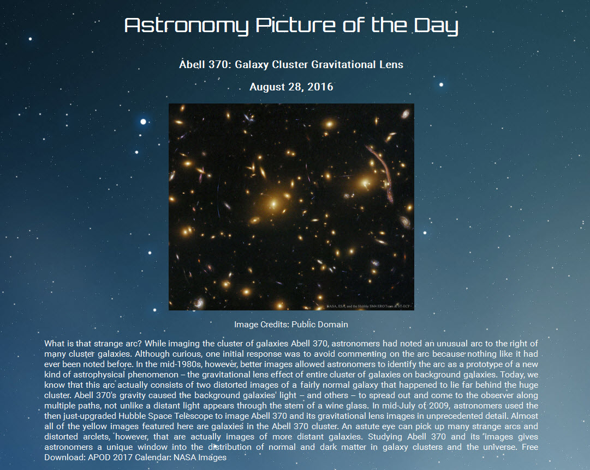

This displayed the Astronomy Photo of the Day by accessing the NASA API.  
Uses JavaScript, jQuery.  

NASA encourages developers to make their own Astronomy Picture of the Day site.   
I find the NASA APOD to be cluttered, so I created a site I felt was much more organized and displayed the information  
in a much more accessible form.

 

Deployed at:  http://joanmarieverba.name/astronomy/
